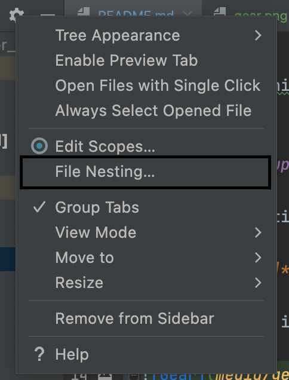
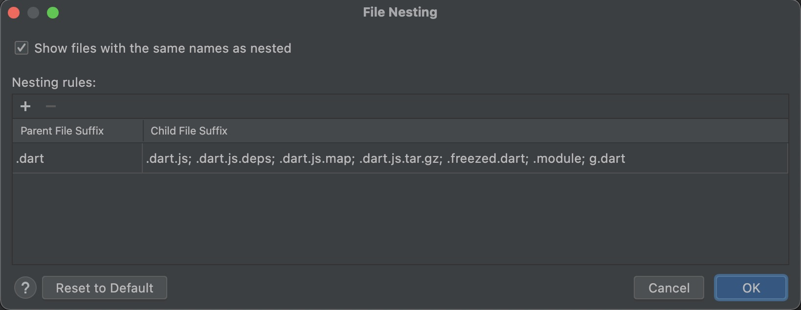

# sample_app

Generated by initstate.dev


## Setup

A couple of setup steps before the project is ready to use.


### Automatic

Run the `setup_[your_os]` to fully configure your app.

### Manual

Install:
- [FVM](https://fvm.app/docs/getting_started/installation)
- [Flutterfire](https://firebase.flutter.dev/docs/cli#installation) for firebase

Run:

```
fvm flutter pub get
```

and

```
flutterfire configure
```


<!--
#### **[Optional]** File nesting setup

Go to the gear icon on the project panel. Go to File Nesting and add freezed.dart and g.dart to the nesting.




This will cause generated files to be collapsed.
-->


# Building

Running build runner for freezed classes:

```
fvm flutter pub run build_runner build --delete-conflicting-outputs
```

Building the app for Android

```
fvm flutter build --apk TODO CHECK
```


# Testing

To run all unit and widget tests run:

```
fvm flutter test --coverage
```

to generate a human-readable html page run

```
genhtml -o coverage coverage/lcov.info
```


site:{{getting_started_content}}